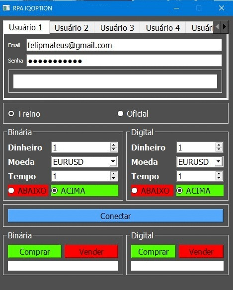

**RPA_IQOPTION_10_ACCOUNTS**

 

**Este bot possibilita operar em 10 (dez) contas diferentes ao mesmo tempo. Porém, restrito apenas nas opções e degital.**

**Conteudo:**
 * Codigo backEnd 
 * Codigo Front

**Funções comentadas:**

* Binaria/Digital
  Dinheiro: O valor a ser comprado da opcao, esse valor sera na moeda 
  a qual esta sendo negociado a opcao.
  Moeda: Uma lista de todas as opcoes binarias e digital para ser negociado.
  Tempo: E o intervalo de tempo entre a compra e venda da opcao selecionada.
  Abaixo/Acima: O sentido do futura da opcao. Existe duas possibilidades, 
  ou ira para cima, ou para baixo.

* Conectar
  Muito importante ler aqui!
  O botao conectar está abaixo de todas opcões por um motivo! Toda vez antes quando
  o usuario precisar mudar as configuracoes da operacao, sera necessario clicar em conectar
  novamente. Posteriormente, podera comprar e vender quantas vezes quiser.

* Compra/Venda
  Essa funcao bem explicita, pois nela sera feita a operacao de venda da opcao selecionada anteriormente.
  Compra e venda quantas vezes quiser, porem quando for necessario alterar alguma caracteristica da opcao selecionada
  sera necessario apertar no botao conectar novamente. 

OBS: A necessidade de conectar toda vez que alterar alguma caracterisca e devido a necessidade de contornar um problema enfretado pela API.
OBS2: Algumas modificações não eficientes foram realizadas para contornar um problema com a API.
